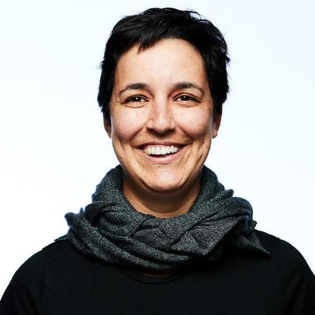
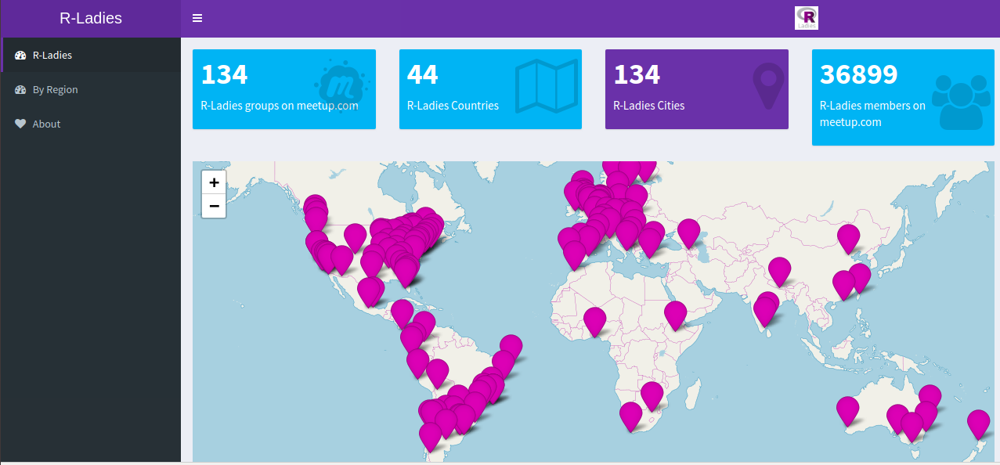

class:  inverse, center, middle
```{r setup, include=FALSE}
options(htmltools.dir.version = FALSE,  fig.align = 'center')
```
# Introduction to R - Instructors for today:

**Alissa Munerato** - Studying Bachelor's Degree in Science and Technology (UFABC) and Bachelor's Degree in Neuroscience (UFABC) - **alissamunerato@gmail.com**

 **Beatriz Milz** - Bachelor's Degree in Environmental Management (USP), Master's Degree in Sciences (Environmental Analisys Program - UNIFESP) - **beatriz.milz@hotmail.com** - [Webpage](https://beatrizmilz.github.io)

**Haydée Svab** - Bachelor's Degree in civil Engineering and Bachelor's Degree in Architecture (USP), Master's Degree in Transportation Engineering (POLI-USP), 
Specialist in Participatory Democracy, Republic and Social Movements (UFMG), 
Phd Candidate in Computer Sciences – Smart Cities (IME-USP) - **hsvab@hsvab.eng.br**


[R-Ladies São Paulo](https://www.meetup.com/pt-BR/R-Ladies-Sao-Paulo)

[2018 CODATA-RDA School of Research Data Science](http://www.ictp-saifr.org/2018-codata-rda-school-of-research-data-science/)


---
class:  inverse, center, middle
# What is R-Ladies?

Worldwide organization that  promotes **gender diversity** in the R community. 

# How?

Meetups and mentorship in a friendly and safe environment. 


# For whom?
Underrepresented genders - including but not limited to cis/trans women, trans men, non-binary, genderqueer, agender


Reference: [About us - R-Ladies](https://rladies.org/about-us/)

---
class:  inverse, center, middle
# Mission 

As a diversity initiative, the mission of R-Ladies is to achieve proportionate representation by encouraging, inspiring, and empowering people of genders currently underrepresented in the R community.


Reference: [About us - R-Ladies](https://rladies.org/about-us/)


---
class:  inverse, center, middle
# How did R-Ladies begin?
```{r echo=FALSE, fig.align='center', out.width="50%"}

```
**[Gabriela de Queiroz](https://github.com/gdequeiroz)** founded R-Ladies on **October 1, 2012**. She wanted to give back to the community after going to several meetups and learning a lot for free.  The first meetup was placed in **San Francisco, California (United States)**. In the following years more R-Ladies chapters started around the globe. 

Reference: [About us - R-Ladies](https://rladies.org/about-us/history/)

---
class:  inverse, center, middle

```{r echo=FALSE, out.width="100%"}

```


Reference: [R-Ladies Shiny App](https://gqueiroz.shinyapps.io/rshinylady/)  (03/12/2018)

---
class:  inverse, center, middle
# Code of conduct

R-Ladies is dedicated to providing a harassment-free experience for everyone. We do not tolerate harassment of participants in any form.


[R-Ladies Code of Conduct](https://rladies.org/code-of-conduct/)


---
class:  inverse, center, middle
# How to get involved

[Meetup](https://www.meetup.com/pt-BR/R-Ladies-Sao-Paulo)

Twitter: [@RLadiesGlobal](https://twitter.com/rladiesglobal)

Website: [https://rladies.org/](https://rladies.org/)

R-Ladies LATAM Blog (Latin America) - Comming soon!


[R-Ladies - How do get involved](https://rladies.org/about-us/help/)

---
class:  inverse, center, middle

#Thank you! 
```{r echo=FALSE, fig.align='center'}
knitr::include_graphics("1meetupsp.jpeg")
```
**First R-Ladies São Paulo Meetup**

Made with [Xaringan](https://github.com/yihui/xaringan) and [Kunoichi](https://github.com/emitanaka/ninja-theme).
